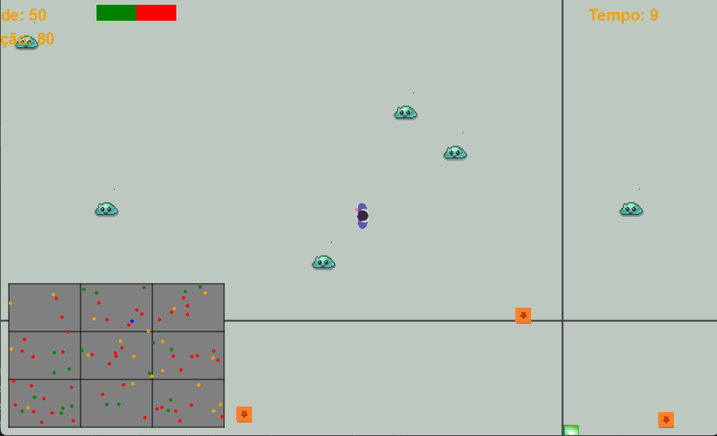

Game Survival

Game Survival é um jogo de sobrevivência em 2D desenvolvido em Java com JavaFX, onde você assume o papel de um sobrevivente em um ambiente hostil. Enfrente inimigos com inteligência artificial, colete itens como munição e kits de saúde, e avance por fases com dificuldade crescente. O jogo combina gráficos vibrantes, efeitos sonoros imersivos e mecânicas de ação/estratégia para uma experiência divertida e desafiadora.
Índice

Sobre o Projeto
Funcionalidades
Requisitos
Instalação e Execução
Status do Desenvolvimento
Roadmap
Como Contribuir
Licença
Contato

Sobre o Projeto
Game Survival é um projeto indie desenvolvido por Jucie Lima. O jogo é construído com Java 21, JavaFX para interface gráfica e áudio, e org.json para configuração dinâmica de fases. Ele está em fase alfa avançada, com mecânicas principais implementadas e foco em polimento técnico. O código é modular, facilitando expansões futuras, como suporte a multiplayer ou plataformas adicionais.
O repositório está disponível em: github.com/JucieLima/game_survival.
Funcionalidades

Jogabilidade: Movimento do jogador, colisões, coleta de itens (munição, saúde) e eliminação de inimigos.
IA de Inimigos: Comportamentos de patrulha e perseguição, com raio de detecção e velocidades ajustáveis por fase.
Sistema de Fases: Configurado via phases.json, com níveis que aumentam o número de inimigos e itens.
Interface Gráfica: Interface em JavaFX com FXML, incluindo minimapa, HUD e spritesheets para entidades.
Áudio: Música de fundo, efeitos de tiros, passos, coleta de itens e temas de vitória/derrota.
Build: JAR executável gerado com Maven e maven-shade-plugin, incluindo todas as dependências.

Requisitos

JDK 21: Para compilar e executar o projeto.
Maven 3.8+: Para gerenciar dependências e build.
JavaFX SDK 21.0.7: Para interface gráfica e áudio (ou JavaFX 23.0.1, conforme pom.xml).
Sistema Operacional: Testado no Windows 10/11 (suporte a Linux/Mac planejado).

Instalação e Execução
1. Clonar o Repositório
   git clone https://github.com/JucieLima/game_survival.git
   cd game_survival

2. Instalar Dependências
   Certifique-se de ter o JDK 21 e Maven instalados. Para instalar as dependências:
   mvn clean install

3. Configurar o JavaFX SDK

Baixe o JavaFX SDK 21.0.7 (ou 23.0.1, conforme pom.xml).
Extraia para um diretório, por exemplo: C:\Program Files\Java\javafx-sdk-21.0.7.

4. Compilar o Projeto
   mvn clean package

Isso gera o JAR com dependências em target/SurvivalGame-1.0-SNAPSHOT.jar.
5. Executar o Jogo
   Via Maven (recomendado para desenvolvimento):
   mvn javafx:run

Via JAR:
java --module-path "C:\Program Files\Java\javafx-sdk-21.0.7\lib" --add-modules com.survival.survivalgame,javafx.controls,javafx.fxml,javafx.media -cp target/SurvivalGame-1.0-SNAPSHOT.jar com.survival.survivalgame.Game

Via JAR no diretório de artefatos:
Copie o JAR para o diretório de artefatos e execute:
cd out/artifacts/SurvivalGame_jar
java --module-path javafx-sdk-21.0.7\lib --add-modules com.survival.survivalgame,javafx.controls,javafx.fxml,javafx.media -cp SurvivalGame.jar com.survival.survivalgame.Game

6. Testar Recursos (Áudio e JSON)
   Para verificar o carregamento de phases.json e arquivos de áudio:
   mvn javafx:run -Djavafx.run.class=com.survival.survivalgame.ResourceTest

Saída Esperada:
Recurso encontrado: /com/survival/survivalgame/phases.json
Recurso encontrado: jar:file:/.../SurvivalGame.jar!/com/survival/survivalgame/sounds/background_music.mp3
...

Status do Desenvolvimento

Fase: Alfa avançada (v0.1, não lançada).
Funcionalidades Implementadas:
Mecânicas de jogo: movimento, colisões, coleta de itens, combate.
IA de inimigos com patrulha e perseguição.
Sistema de fases dinâmico via JSON.
Interface gráfica com minimapa e HUD.
Suporte a áudio (música de fundo, efeitos sonoros).

Desafios Resolvidos:
Carregamento de recursos (JSON e áudio) no JAR.
Integração de dependências (org.json, JavaFX) com maven-shade-plugin.
Correção de erros de classpath para org.json.JSONArray.

Problemas Pendentes:
Alinhar JavaFX 23.0.1 (pom.xml) com SDK 21.0.7 ou atualizar para 23.0.1.
Publicar release v0.1 com JAR executável.

Roadmap

Curto Prazo (Novembro 2025):
Lançar v0.1 com demo jogável no GitHub Releases.
Adicionar README com screenshots e vídeo demo.
Corrigir versão do JavaFX no pom.xml (21.0.7).

Médio Prazo (Q1 2026):
Expandir fases com mais níveis e variedade.
Implementar salvamento de progresso.
Otimizar áudio (loop infinito, controle de volume).

Longo Prazo (Q2 2026):
Suporte a multiplayer local.
Portar para mobile via Gluon Mobile.
Suporte cross-platform (Linux/Mac).

Como Contribuir
Gostou do projeto? Contribua com ideias, correções ou novas funcionalidades!

Faça um fork do repositório.
Crie uma branch: git checkout -b minha-feature.
Commit suas mudanças: git commit -m "Adiciona minha feature".
Envie para o repositório: git push origin minha-feature.
Abra um Pull Request.

Sugestões de Contribuição:

Melhorar a IA dos inimigos (novos comportamentos).
Adicionar sprites ou efeitos visuais.
Criar testes unitários para GameController e SoundManager.
Documentação (screenshots, vídeos, wiki).

Licença
Este projeto é licenciado sob a MIT License (a ser adicionada).
Contato

Desenvolvedor: Jucie Lima
GitHub: JucieLima
X/Twitter: @JucieLima (adicione seu handle, se aplicável)
Issues: Abra uma issue no GitHub para bugs ou sugestões.

Jogue, contribua e ajude a tornar o Game Survival um sucesso indie! 🎮Dê uma ⭐ no repositório se gostou do projeto!